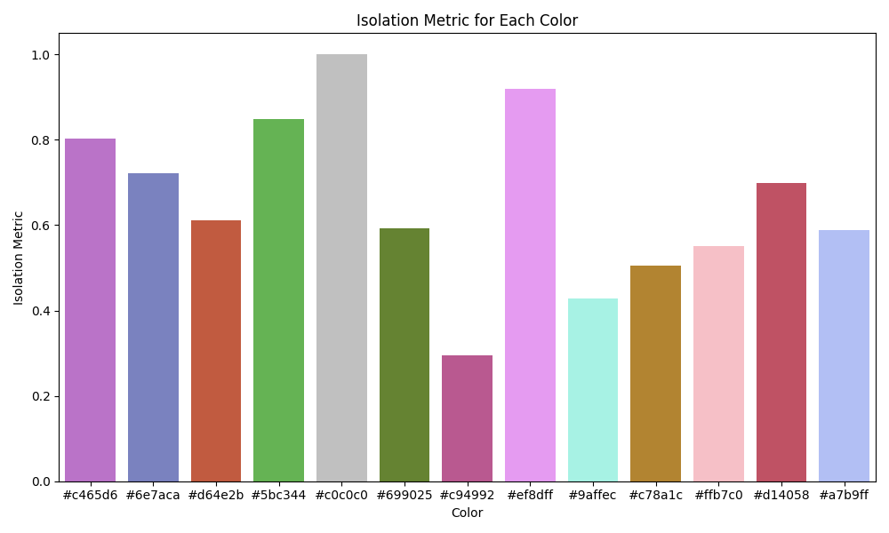
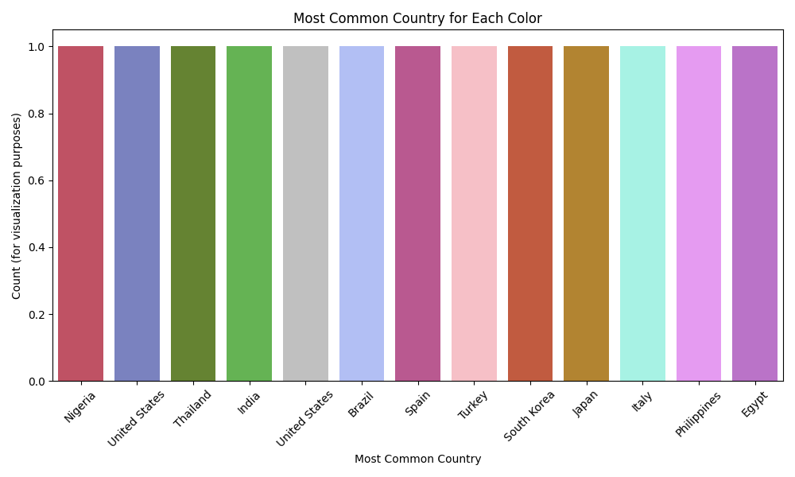
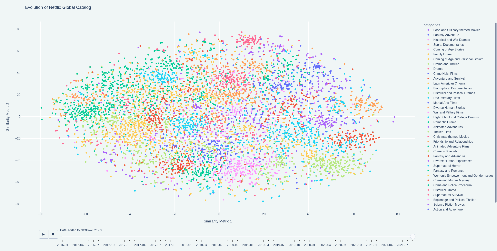
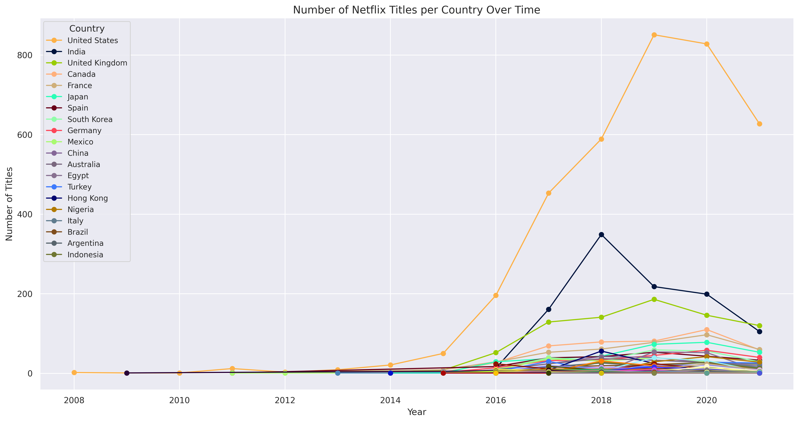
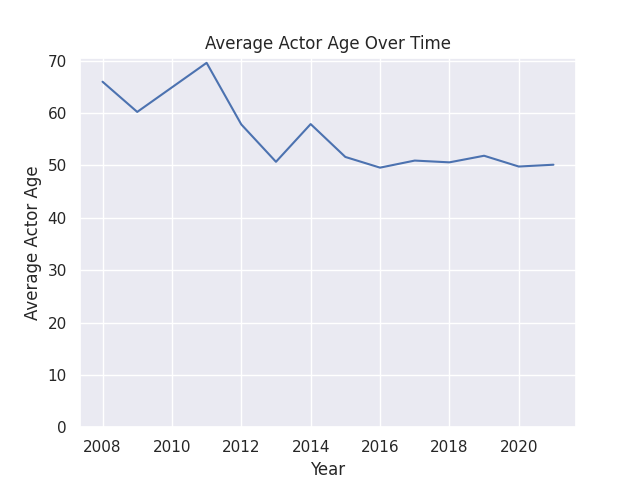
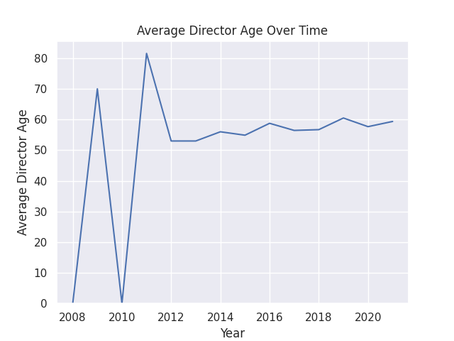
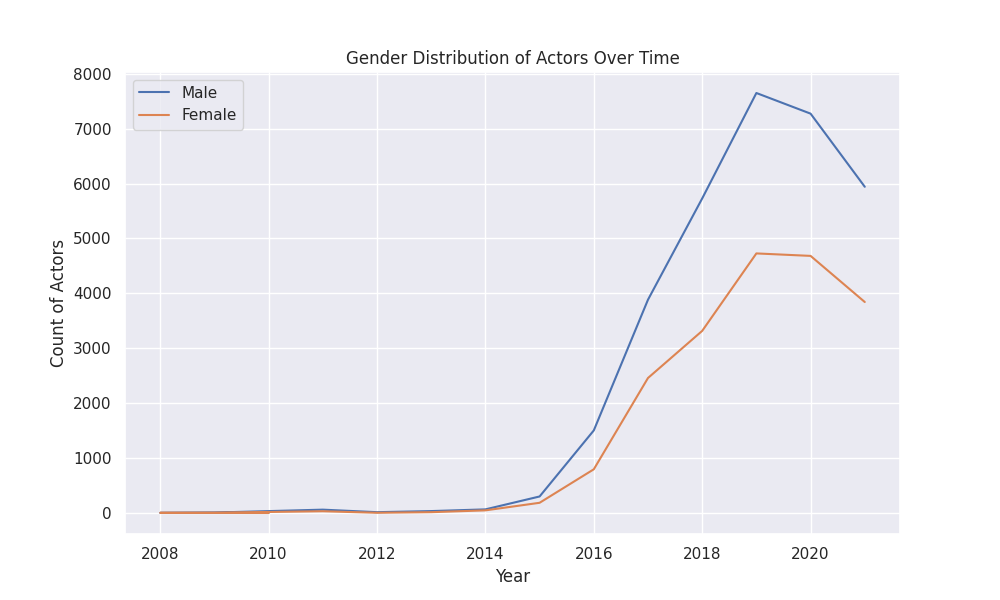
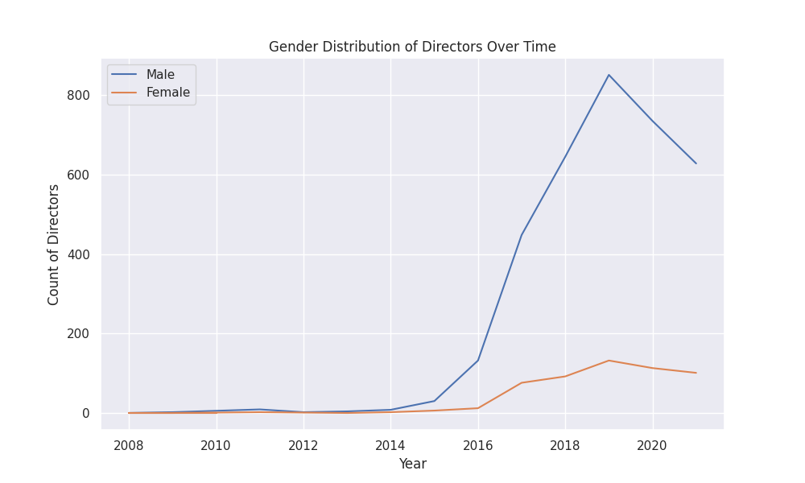
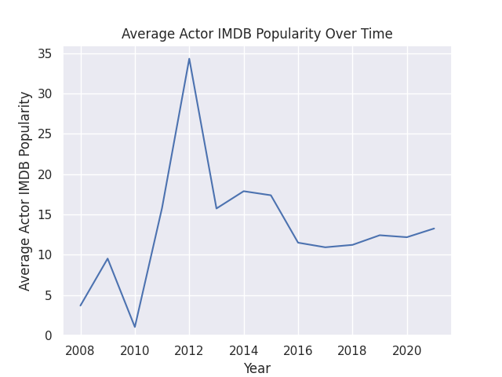
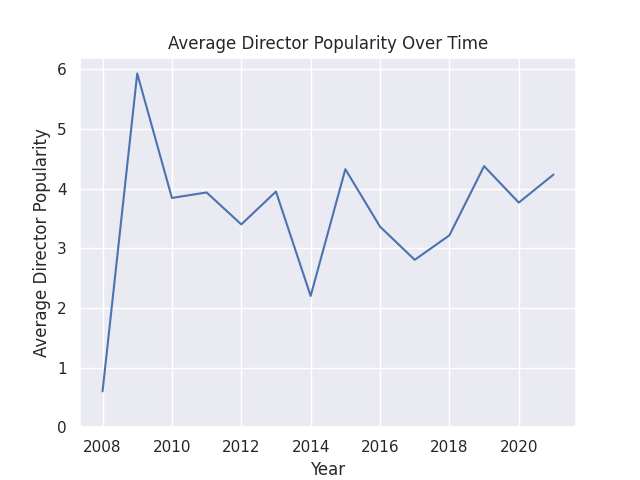

# Meta Data Science Case Competition 2023

This is a quick showcase of a few things we were able to generate for the Meta Data Science Case Competition 2023 at UVA.
The contest was a week long, and we were given a historical dataset of the Netflix catalog.
We ended up using lots of outside data (TMDB, IMDB, Wikipedia, etc.) to generate our final suggestions that were on a 10 slide presentation.

```
Note: This was only my part of the project. Other Graphs and Visualizations were made by my teammates as well for the final presentation.
```

## Network Graph of Netflix Talent (Connected by Worked With on a Project)


### Node Size is Proportional to TMDB Popularity. Color is auto-identified by Gephi's community detection algorithm.




## Animated (Open [HTML](generated/cluster_individual_month_year_global.html) File to See) Map of Titles Added Semantically Clustered Through K-Means and Labeled by GPT with Descriptions.



## Number of Titles Per Production Country Over Time



## Misc Graphs Not Presented in Final Presentation







